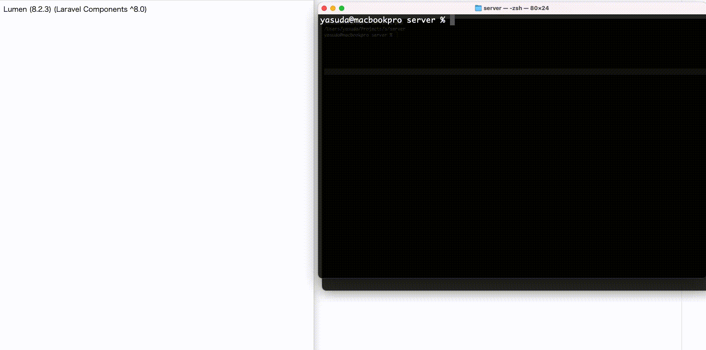

## Welcome to lumaintenance

This repository allows you to use the maintenance features in Lumen.

There are two ways to make maintenance changes: by generating a local file or by using environment variables.

## Required for installation

```
php: ^7.3|^8.0
laravel/lumen-framework: ^8.0
```

## setup (Run within the Lumen project)

### 1. Installation

```
composer require yasudacloud/lumaintenance
```

### 2. Add the following to bootstrap/app.php

```
use Lumaintenance\Providers\LumaintenanceServiceProvider;


$app->register(LumaintenanceServiceProvider::class);
```

### 3. Copy the configuration file
```
cp vendor/yasudacloud/lumaintenance/config/lumaintenance.php config/lumaintenance.php
```

# Use

### Maintenance status

``` 
php artisan lumain
```

### Use a local file to put it in a maintenance state.

```
php artisan lumain:local down
```

### If you want to restrict by IP address

```
php artisan lumain:local down --allow=127.0.0.1,192.168.0.100
```

### Restore the original state

```
php artisan lumain:local up
```

## Changing the maintenance status by environment variables

```
LUMAIN_IS_DOWN=true
```

LUMAIN_IS_DOWN must be set to something other than blank.

```
LUMAIN_EXCLUDE_PATH=api/healthcheck
```

For LUMAIN_EXCLUDE_PATH, enter the path you want to exclude from maintenance, such as a health check.

You can leave it blank, but you can only set one.

```
LUMAIN_ALLOW_IPS=127.0.0.1,192.168.0.100
```

LUMAIN_ALLOW_IPS sets the whitelist of IP addresses as well as the local file.

Note, however, that the IP address set in LUMAIN_ALLOW_IPS will also be set for local file maintenance.

## DEMO


## Customize the maintenance page
```
mkdir -p resources/views/lumaintenance
cp vendor/yasudacloud/lumaintenance/resources/views/maintenance.blade.php resources/views/lumaintenance/maintenance.blade.php
```

## Other
The HTTP status code for the maintenance page is 503 status code by default. You can change the setting in lumaintenance.php.


## Contact
If you find any problems, please contact us at

```
hello@yasuda.cloud
```

Thanks to DeepL for the translation!
